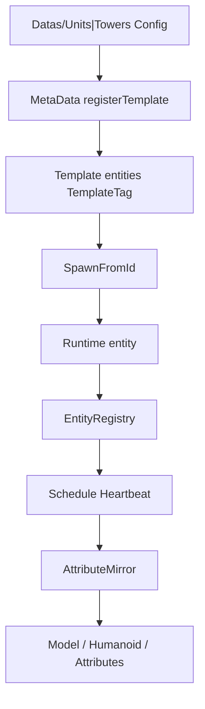

# Tree / jecs Runtime — API e funcionamento

Documentação da camada ECS do AnimeDomains (`src/Classes/`).

**Require root:** `ReplicatedStorage.Shareds.Classes`  
**Autoridade:** World jecs no **servidor**. Cliente usa Models/Humanoids/attributes como view.

---

## Visão geral



Ordem do frame (servidor):

1. `PositionSystem` — HRP → `Position`
2. `TargetingSystem` — escolhe `Target` / `BuildingTarget`, seta `AttackEnabled`
3. `MovementSystem` — Pathfinder segue troop ou approach da torre
4. `AttackSystem` — cooldown + dispara ataque
5. `HealthSystem` — `Health <= 0` → `Dead` → despawn

Boot: `src/Boot/Game/Server.server.luau` chama `UnitsMetaData.EnsureLoaded()`, `TowerMetaData.EnsureLoaded()`, depois `Tree.Systems.Schedule.Start()`.

---

## 1. Mega

**Path:** `src/Classes/Mega.luau`  
**Require:** `ReplicatedStorage.Shareds.Classes.Mega`

Facade do World jecs. Componentes **não** podem ser required no load do Mega (ciclo: Primitive → Mega → Primitive).

### API

| Campo / função | Tipo | Descrição |
|---|---|---|
| `World` | `jecs.World` | World único do projeto (`jecs.World.new(true)`) |
| `Jecs` | package | Referência ao módulo `jecs` |
| `Utils.GetUnitMetadataWithID(unitId)` | `(string) → entity?` | Query template por `ID` + `TemplateTag` |

```luau
local Mega = require(ReplicatedStorage.Shareds.Classes.Mega)
local World = Mega.World
local e = World:entity()
World:set(e, SomeComponent, value)
```

---

## 2. Components

**Path:** `src/Classes/Tree/Build/Components/`

Cada Primitive é `Mega.World:component()`. Cada Tag é `Mega.World:entity()` (marcador sem payload).

### Tags (`Components/Tags/`)

| Módulo | Uso |
|---|---|
| `UnitTag` | Entidade é unidade (template ou instância) |
| `TowerTag` | Entidade é torre |
| `TemplateTag` | Receita imutável — **nunca** mutar em combate; systems usam `:without(TemplateTag)` |
| `Dead` | Marcada para despawn; systems ignoram com `:without(Dead)` |

### Primitives — stats / receita

| Módulo | Tipo típico | Notas |
|---|---|---|
| `ID` | `string` | CardId / TowerId (`"Sabre"`, `"Dummy"`) |
| `Level` | `number` | |
| `HealthBase` | `number` | HP base da receita |
| `Health` | `number` | HP atual (autoritativo no runtime) |
| `BaseDamage` | `number` | |
| `Damage` | `number` | Dano efetivo (cópia no spawn) |
| `RangeBase` / `Range` | `number` | Alcance |
| `DelayAttack` | `number` | Cooldown entre ataques (segundos) |
| `DeployTime` | `number` | Cutscene / deploy |
| `EnergyCost` | `number` | |
| `Walk` | `number` | WalkSpeed |
| `Velocity` | `Vector3` | |
| `Position` | `Vector3` | Atualizado pelo PositionSystem |
| `ModelID` | `string` | Asset id do modelo |
| `Model` | `Model` | Referência ao Instance Roblox |
| `Class` | `string` | Tier de carta (`"S"`, …) |
| `TargetKing` | `"Buildings" \| "Ground" \| "Air" \| "All"` | Preferências de alvo (nome histórico) |
| `CanRetargetTroops` | `boolean` | Unidade pode aggro em tropas |

### Primitives — runtime de combate

| Módulo | Tipo típico | Notas |
|---|---|---|
| `UID` | `string` | GUID de rede / lookup |
| `Owner` | `string` | `Player.Name` ou `"Enemy"` |
| `Team` | `"One" \| "Two"` | |
| `Kind` | `string` | `"Unit"` / `"Tower"` / … |
| `Ready` | `boolean` | Pós-cutscene |
| `AttackEnabled` | `boolean` | Em range para atacar |
| `Attacking` | `boolean` | Swing em andamento |
| `Target` | `number` | Entity id do alvo (ou `0`) |
| `BuildingTarget` | `number` | Entity id da torre de foco (unidades) |
| `LastAttack` | `number` | `os.clock()` do último ataque |
| `TowerSlot` | `string` | `"Left"` / `"Main"` / `"Right"` |
| `Anchor` | `Model` | Modelo âncora do mapa (path/UI), **não** o corpo de combate |

### Stubs (existem, pouco/não usados no runtime)

`Combo`, `ComboCount` — placeholders; não entram nos systems atuais.

---

## 3. MetaData (factories)

### 3.1 UnitsMetaData

**Path:** `Build/MetaData/UnitsMetaData.luau`  
**Require:** `…Tree.Build.MetaData.UnitsMetaData`

#### Tipos principais

```luau
export type UnitConfig = {
  Id: string,
  Name: string,
  Level: number,
  BaseHealth: number,
  BaseDamage: number,
  BaseRange: number,
  DelayAttack: number,
  DeployTime: number,
  EnergyCost: number,
  Class: string,
  ModelID: string,
  Position: Vector3,
  Walk: number,
  Velocity: Vector3,
  TargetKind: TargetKindValue,
  CanRetargetTroops: boolean,
  CardImage: string?,
  CardBack: string?,
  ExpCurrent: number?,
  ExpMax: number?,
}

export type SpawnFromIdOptions = {
  Position: Vector3?,
  Model: Model?,
  Level: number?,
  Health: number?,
  UID: string?,
  Owner: string?,
  Team: string?,
  Ready: boolean?,
  Kind: string?,
}
```

#### API

| Função | Descrição |
|---|---|
| `registerTemplate(config)` | Cria entity com `UnitTag` + `TemplateTag`, preenche stats, registra no `UnitCardRegistry` |
| `new(config)` | Alias de `registerTemplate` (compat) |
| `EnsureLoaded()` | Require de `Datas/Units/*` e registra configs (`Id` único ou lista) |
| `GetCardParams(unitId)` | Params de UI/carta (sem World) |
| `GetTemplate(unitId)` | Entity id do template |
| `SpawnFromId(unitId, options?)` | Clona template → instância **sem** `TemplateTag`; seta runtime fields |

Datas (`Datas/Units/Sabre.luau`, `Placeholders.luau`) exportam **só Config** (tabela ou array). Quem registra é `EnsureLoaded`.

---

### 3.2 TowerMetaData

**Path:** `Build/MetaData/TowerMetaData.luau`

#### Tipos principais

```luau
export type TowerConfig = {
  Id: string,
  Name: string?,
  Level: number,
  BaseHealth: number,
  BaseDamage: number,
  BaseRange: number,
  DelayAttack: number?,
  EnergyCost: number,
  Position: Vector3,
  Walk: number,
  TargetKind: TowerTargetKind?,
  Upgrade: { DamagePerLevel: number, HealthPerLevel: number, RangePerLevel: number }?,
}

export type SpawnFromIdOptions = {
  Position: Vector3?,
  Model: Model?,
  Level: number?,
  Health: number?,
  UID: string?,
  Owner: string?,
  Team: string?,
  Ready: boolean?,
  Kind: string?,
  TowerSlot: string?,
  Anchor: Model?,
}
```

#### API

| Função | Descrição |
|---|---|
| `registerTemplate` / `new` | Template com `TowerTag` + `TemplateTag` |
| `EnsureLoaded()` | Carrega `Datas/Towers/*` |
| `GetCardParams(towerId)` | Recipe para spawn/cálculo (inclui `HealthPerLevel`, `DelayAttack`) |
| `GetTemplate(towerId)` | Entity template |
| `SpawnFromId(towerId, options?)` | Instância de combate; pode setar `Anchor` + `TowerSlot` |

---

### 3.3 UnitCardRegistry / TowerCardRegistry

**Paths:** `Build/MetaData/UnitCardRegistry.luau`, `TowerCardRegistry.luau`

Registries **sem** dependência de Mega no load (evita ciclo com `EntityHelper`).

| Função | Descrição |
|---|---|
| `Set(id, params)` | Grava params |
| `Get(id)` | Lê params |
| `EnsureLoaded()` | Delega para `UnitsMetaData` / `TowerMetaData.EnsureLoaded` |
| `MarkLoaded` / `IsLoaded` | Flag de carga |

`EntityHelper.GetEntityDataByCardId` / `GetTowerDataById` leem esses registries.

---

## 4. Runtime

### 4.1 EntityRegistry

**Path:** `Tree/Runtime/EntityRegistry.luau`  
**Server-only** em `Register` / `Delete`.

Índice O(1) entre UID, Model e entity jecs.

| Função | Assinatura | Descrição |
|---|---|---|
| `Register` | `(entity, uid, model?)` | Mapeia uid/model; seta componentes `UID` e `Model` |
| `GetByUid` | `(uid) → entity?` | |
| `GetByModel` | `(model) → entity?` | |
| `GetModel` | `(entity) → Model?` | Lê componente `Model` |
| `GetUid` | `(entity) → string?` | |
| `Unregister` | `(entity)` | Limpa mapas (não deleta do World) |
| `Delete` | `(entity)` | `Unregister` + `World:delete` |

```luau
local EntityRegistry = require(...Tree.Runtime.EntityRegistry)
local e = UnitsMetaData.SpawnFromId("Sabre", { UID = uid, Model = model, ... })
EntityRegistry.Register(e, uid, model)
```

---

### 4.2 AttributeMirror

**Path:** `Tree/Runtime/AttributeMirror.luau`

Espelha estado ECS → atributos do Model / `Humanoid.Health` (replicação + billboards + validação cliente).

| Função | Descrição |
|---|---|
| `SyncEntity(entity)` | Copia `Ready`, `AttackEnabled`, `Attacking`, `Health` para a view |
| `SetReady(entity, bool)` | World + sync |
| `SetAttackEnabled(entity, bool)` | World + sync |
| `SetAttacking(entity, bool)` | World + sync |
| `SetHealth(entity, number)` | World + sync Humanoid |

Dano autoritativo:

```luau
-- CombateStateHandler.ApplyDamageToTarget
AttributeMirror.SetHealth(entity, math.max(0, current - damage))
```

---

## 5. Systems

**Path:** `Tree/Systems/`  
**Só servidor** (via `Schedule.Start`).

### 5.1 Schedule

| Função | Descrição |
|---|---|
| `Start()` | Conecta um `Heartbeat`; idempotente |
| `Stop()` | Disconnect |

Ordem fixa no Heartbeat: Position → Targeting → Movement → Attack → Health.

---

### 5.2 PositionSystem

| Função | Descrição |
|---|---|
| `Update(dt)` | Para cada entity com `Model` (sem Template/Dead): `HumanoidRootPart.Position` → `Position` |

---

### 5.3 TargetingSystem

| Função | Descrição |
|---|---|
| `Update(dt)` | Unidades e torres escolhem alvo |

**Unidades** (`UnitTag`):

- Precisa `Ready == true`
- Mantém `BuildingTarget` (entity da torre spawnada viva / mais próxima)
- Se `CanRetargetTroops` e kind ≠ Buildings: aggro troop em range; senão foca building
- Grava `Target` (entity id ou `0`)
- `AttackEnabled` se em range (torre usa raio de detecção da âncora; troop usa `Range`)

**Torres** (`TowerTag`):

- Alvo = troop inimigo mais próximo em `Range`
- `AttackEnabled` se há alvo válido

---

### 5.4 MovementSystem

Adapter Pathfinder (não é “puro” ECS — guarda controllers Luau por entity id).

| Função | Descrição |
|---|---|
| `RegisterUnit(entity, model, uid, cardId, walkSpeed)` | Cria Pathfinder + PathTarget + HumanoidManager; `Run()` |
| `Unregister(entity)` | Destroy janitor/controller |
| `Update(dt)` | Segue `Target` troop ou approach de `BuildingTarget`/`Anchor`; pausa se `AttackEnabled`; anima Idle/Walk |

Chamado por `CardsEntityManager.BuildEntityPath` após o spawn ECS.

---

### 5.5 AttackSystem

| Função | Descrição |
|---|---|
| `BindUnitAttack(entity, uid)` | Cria meta `EntityActionManager:GetUnitAttack(uid)` |
| `Unbind(entity)` | Destroy meta |
| `Update(dt)` | Dispara ataques |

**Unidades:** se `AttackEnabled` + `TargetUID` + cooldown (`DelayAttack` / `LastAttack`) + não `Attacking` → `meta:Attack()` (módulo Sabre etc.), atualiza `LastAttack`.

**Torres:** dano direto via `CombateStateHandler:ApplyDamageToTarget` + `BindAttack_Replica`; limpa `Attacking` após `DelayAttack`.

`EntityActionManager` / `CombateStateHandler` são required **lazy** (evita ciclo de módulos).

---

### 5.6 HealthSystem

| Função | Descrição |
|---|---|
| `Update(dt)` | `Health <= 0` → add `Dead` → `CardsEntityManager:DespawnEntity` (lazy require) |

`DespawnEntity` também limpa path/attack janitors, marca âncora/lane se torre, delay de death VFX, depois `EntityRegistry.Delete` + `model:Destroy()`.

---

## 6. Datas

**Paths:** `Tree/Datas/Units/*.luau`, `Tree/Datas/Towers/*.luau`

Contrato:

- Exportar **Config** (`{ Id = ... }`) ou **array de Configs**
- **Não** criar entity no `require`
- `EnsureLoaded` das MetaData faz o registro

Exemplos: `Sabre.luau`, `Placeholders.luau` (lista), `Dummy.luau` (torre).

---

## 7. Integração com Services

| Quem | O que faz com a ECS |
|---|---|
| `CardsEntityManager.newEntity` | Clone Model → `UnitsMetaData.SpawnFromId` → `EntityRegistry.Register` → `BuildEntityPath` |
| `CardsEntityManager.BuildEntityPath` | Adapter: `MovementSystem.RegisterUnit` + `AttackSystem.BindUnitAttack` + Died→Despawn |
| `CardsEntityManager.BuildTowerAttack` | Só Died/Destroy hooks (AI na ECS) |
| `CardsEntityManager.DespawnEntity` | Stop path, `Dead`, death delay, `EntityRegistry.Delete` |
| `TowerServiceServer.SpawnMatchTowers` | `TowerMetaData.SpawnFromId` (+ Anchor/Slot) → Register → BuildTowerAttack |
| `CardsServiceServer.StateChangeReadyForUID` | `AttributeMirror.SetReady(entity, true)` |
| `CombateStateHandler.ApplyDamageToTarget` | Subtrai `Health` via AttributeMirror (fallback Humanoid se sem entity) |
| `EntityHelper.GetEntityCharacterForUID` | Preferência: `EntityRegistry.GetByUid` → Model |

Cliente (`CardsEntityManager` client paths) **não** importa Systems no top-level (requires lazy no servidor).

---

## 8. Regras práticas

1. Templates (`TemplateTag`) = receita; instâncias = combate.
2. Dano e targeting leem **entity spawnada**, nunca só o nome da âncora.
3. Âncora fica em `Anchor`; combate/UI de HP no Model em `Units`.
4. Attributes (`Ready`, `Attacking`, …) são **espelho**, não source of truth.
5. Não require Primitive/Tag no body de load do `Mega`.
6. Systems novos: adicionar em `Systems/` e plugar em `Schedule.Start`.

---

## 9. Mapa de pastas

```
src/Classes/
  Mega.luau
  Tree/
    Build/
      Components/
        Primitives/     -- data components
        Tags/           -- UnitTag, TowerTag, TemplateTag, Dead
      MetaData/
        UnitsMetaData.luau
        TowerMetaData.luau
        UnitCardRegistry.luau
        TowerCardRegistry.luau
    Datas/
      Units/            -- Config only
      Towers/
    Runtime/
      EntityRegistry.luau
      AttributeMirror.luau
    Systems/
      Schedule.luau
      PositionSystem.luau
      TargetingSystem.luau
      MovementSystem.luau
      AttackSystem.luau
      HealthSystem.luau
```
